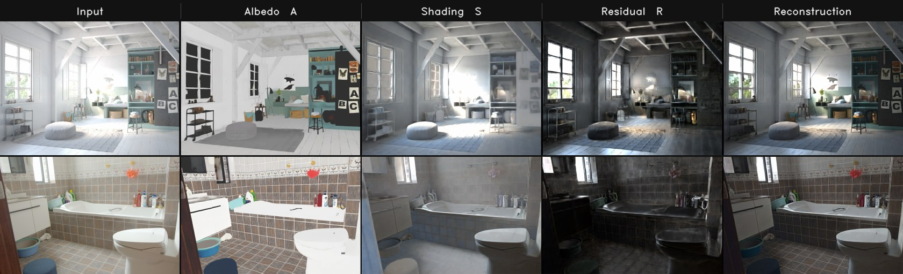

<div align="center">

# MVID

**Multi-view intrinsic decomposition — albedo, shading and the non-diffuse residual, in one pass over all views**

<a href="https://dukang92-mvid-demo.hf.space"></a>



</div>

## What it does

MVID takes several views of one scene and splits every pixel of every view into

```
I = A · S + R
```

- **A** — diffuse albedo. Reflectance, not base colour: metals go dark, because a
  mirror finish carries no diffuse component.
- **S** — three-channel coloured irradiance, unbounded and HDR.
- **R** — the non-diffuse residual: speculars, visible light sources,
  interreflections.

Two choices separate it from single-image intrinsic decomposition.

**The views are decomposed jointly, not one at a time.** A surface seen from
several angles is reasoned about once, across the whole input set, which is what
holds albedo steady between viewpoints — the standard failure of per-image
methods is that one wall comes out a different colour in every frame, which
makes the output useless for anything downstream that spans views.

**R is predicted, not subtracted.** Defining the residual as `I − A·S` turns it
into an error bucket that quietly absorbs every mistake in A and S. Here it is a
head with its own supervision, so a highlight leaves the albedo instead of being
baked into it. The two are also separable by a test the loss can apply: warped
between views, diffuse content agrees and speculars do not.

`S` and `R` are HDR, which is what makes relighting possible downstream:
substituting a new `S′` and rescaling `R` re-lights the scene without touching
the albedo.

## Acknowledgements

Our model builds on [VGGT](https://github.com/facebookresearch/vggt) (Wang et
al., CVPR 2025): the multi-view aggregator is initialized from VGGT's
geometry-pretrained checkpoint, and part of the code in `mvid/` (aggregator,
transformer layers, DPT heads, and utilities) is reused and adapted from the
VGGT codebase. We thank the authors for releasing their excellent work.
